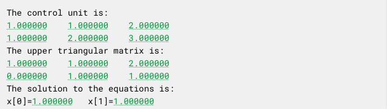
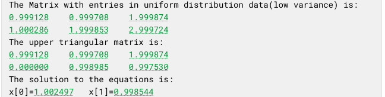
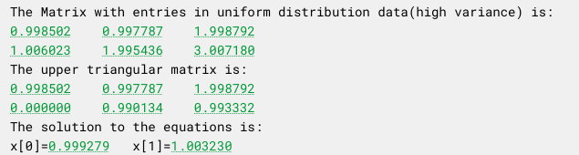
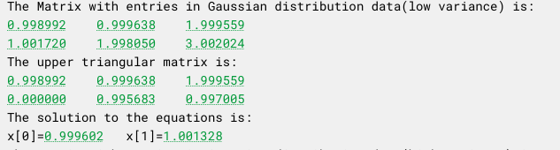
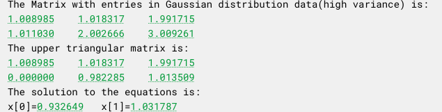
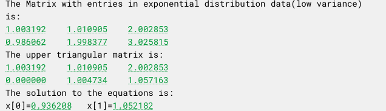
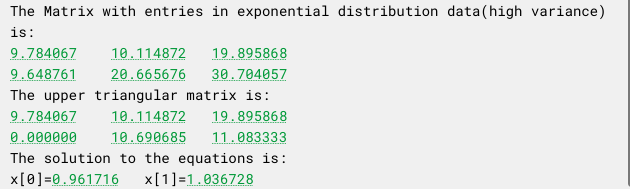

# Gaussian Elimitation Algorithm
Gaussian elimitaiton is a method for solving linear equations $Ax=b$ where $x,b$ are two $n$-dimensional vectors and $A$ is a $n\times n$ matrix. When considerating it in programming, we abbrievate the matrix $A$ and the vector $b$ into a matrix $M$ with indices $n\times (n+1)$. After applying the gaussian elimitation, we will first get a reduced upper triangular matrix after elementary operations to rows of $M^{* }$, and the solution $x$ of the system by solving directly the reduced matrix. 

To see the accuracy of the results obtained by C0 processor, we can actually compare it with a matrix with certain data. A brief statement of the observation is that: the reduced upper triangular matrix of uncertain matrix is very near to the true reduced matrix once the inputs data have the expectations which are near to the true data; however, the solution of equations depends on the distribution of inputs data.

In other words, in order to get a relatively accurate result, it's needed to restrict the expectation and variance of input data: the expectation should be near to the true data and the variance should be relatively low.
## Specific Algorithm of Gaussian Elimitation
### Obtaining the Reduced Upper Triangular Matrix
1. Keeping the first row $M_{1}$ unchanged, then calculate the multipiliers $s_{i}$ of other $n-1$ rows such that the first element of each row becomes zero when we do elementary operation $M_{i}-s_{i}\times M_{1}$.
2. Starting again form the second row where the first element has already been reduced to zero, then calculate the multipiliers $s_{j}$ of other $n-2$ rows such that the second elements of the $n-2$ rows become zero after we do elementary operations as before.
3. Iterate the above procedures until all the elements below diagnal elements are zero.

### Getting the Solution by Operating Directly on the Reduced Matrix
1. For convenience, $M^{* }$ is denoted to be the reduced upper triangular matrix. At the first step, we could easily get the last element of solution $x_{n}$ by inserting $x_{n}=\frac{M_{n,n+1}^{* }}{M_{n,n}^{* }}$.
2. Then, we substitute $x_{n}$ to its original place at the $(n-1)th$ row of $M^{* }$ and calculate $x_{n-1}$.
3. Again, iterating the above procedures could get all the elements in solution $x$.

Check the [main.c](src/main.c) for detailed codes.

## Experiments 
### the Control Unit
To better understand the performance of Signaloid C0 processor, a simple 2-dimensional linear equation system is chosen to be the control unit:

This example verifies the correctness of implemented gaussian elimitation algorithm.

### Uniform Distribution Entries
Now the results, obtained by the algorithm, with entries in uniform distribution are shown. One is of low variance and the other is of high variance.

#### Expectation Near to the True Data and Low Variance

#### Expectation Near to the True Data and High Variance

The comparaison with the control unit shows the algorithm gives relatively correct answers.

### Gaussian Distribution Entries
Here the results, obtained by the algorithm, with entries in gaussian distribution are shown. One is of low variance and the other is of high variance.

#### Expectation Near to the True Data and Low Variance

#### Expectation Near to the True Data and High Variance

The comparaison with the control unit shows that the algorithm gives relatively correct answers when the variance is low, but does not perform well when the variance is high.

### Exponential Distribution Entries
Here the results, obtained by the algorithm, with entries in exponential distribution are shown. One is of low variance and the other is of high variance.

#### Expectation Near to the True Data and Low Variance

#### Expectation Near to the True Data and High Variance

Similarily, the algorithm gives relatively correct answers when the variance is low, but does not perform well when the variance is high. However, comparing with the previous two groups, the results of this group (in case of exponential distribution) are in total lack of accuracy. This might be due to the properties of exponential distribution and the method performs on the matrix which is considerated as the expectations of each entry.

